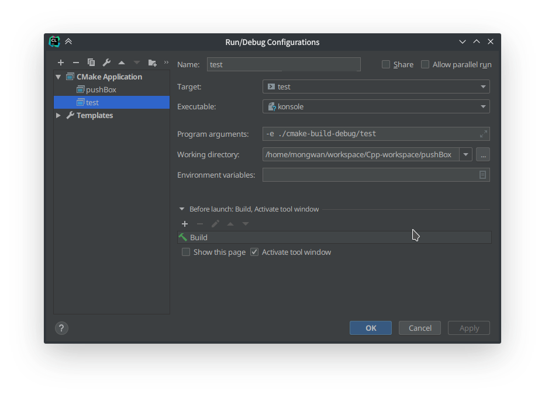
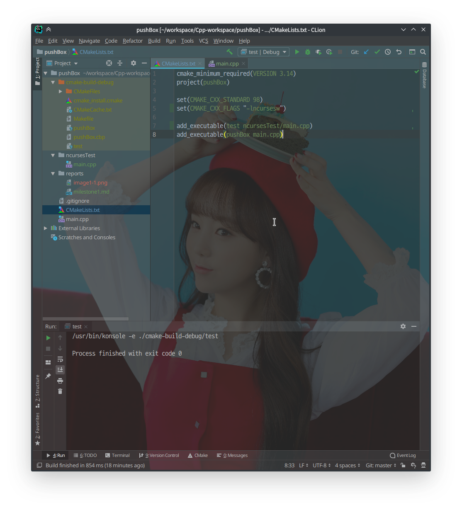
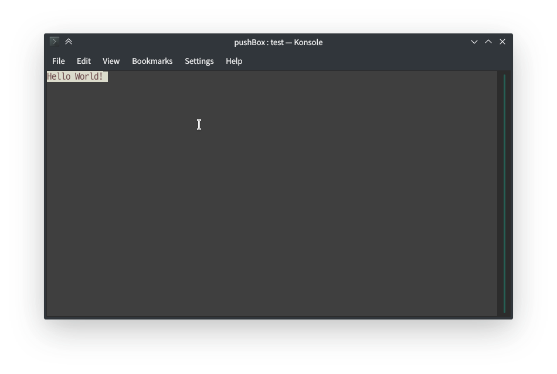
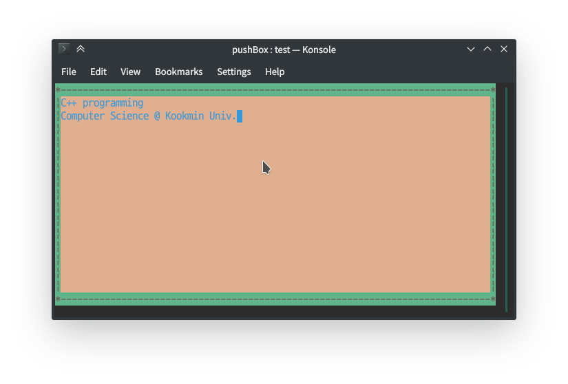
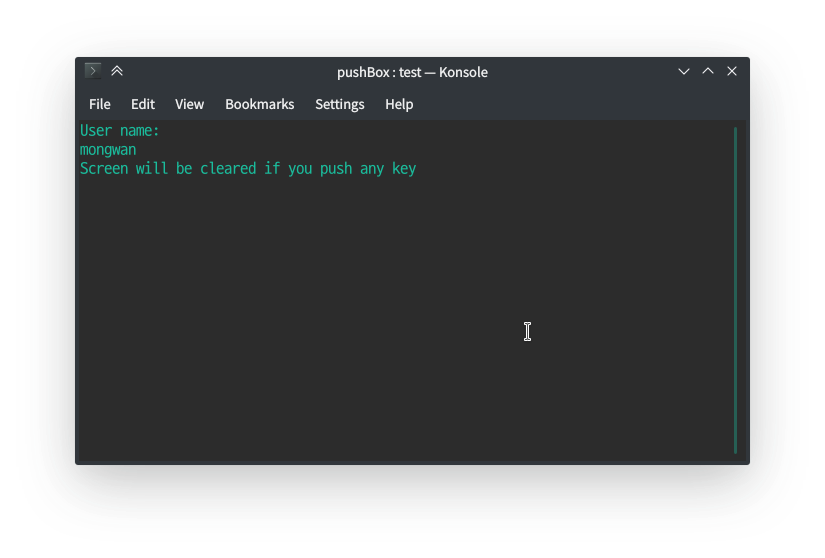
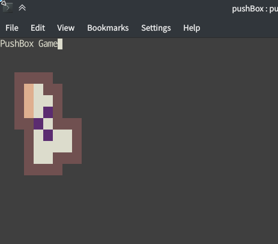

2019 C++ 프로그래밍 프로젝트
==========================
ncurses library를 사용한 Push Box Game 구현
--------------------------
20181649 유현석

# 1단계
## 작업 환경 설정
### CLion
전부터 사용하던 Jetbrain의 CLion을 이번 프로젝트에서도 활용하기 위해 몇가지 설정이 필요했다. CLion 내장 터미널에서는 ncurses가 구동되지 않았기 때문에, 외부 콘솔 창을 여는 것을 설정해야 했다.

현재 데스크탑 환경으로 KDE를 사용하기 때문에, 터미널은 내장되어있는 Konsole을 사용했다. 그림과 같이 설정함으로써 CLion에서 실행 버튼을 누르는 것 만으로 build를 한 뒤에 Konsole을 열어 현재 작성중인 코드를 실행할 수 있게 되었다.
[이 링크의 글](https://stackoverflow.com/questions/36675012/how-to-execute-a-clion-program-in-gnome-terminal)을 참고하였다.

### CMakeLists
CLion에서는 CMake를 이용해 프로그램을 빌드한다. 따라서 CMakeLists.txt를 수정하여 ncurses를 빌드 환경에 추가해주어야한다. 이는 단순히 빌드 옵션에 -lncurses를 추가하는 것으로 가능하다. [이 링크의 글](https://stackoverflow.com/questions/41017629/link-ncurses-in-clion-cmake)을 참고하였다.

## ncurses 기본 알아보기
### 창 띄우기
주어진 예제를 참고하여 터미널 창에 Hello, World!를 출력했다.

    #include <ncurses.h>
    int main() {
        initscr();
        start_color();
        init_pair(1, COLOR_RED, COLOR_WHITE);

        attron(COLOR_PAIR(1));
        printw("Hello World!");
        attroff(COLOR_PAIR(1));

        refresh();
        getch();
        endwin();

        return 0;
    }

- 헤더파일은 ncurses.h를 불러온다.
- initscr() -> initiate screen
- printw(const *chr)은 0, 0 위치에 글자를 출력한다(고 선언한다).
- refresh를 통해 위에 선언되었던 명령들을 실제로 실행한다.
- getch() -> get Character. 명령 없이 창이 닫히지 않도록 실행 
- endwin() -> end Window

### 유니코드 및 색상 설정

    #include <ncurses.h>
    #include <clocale>
    int main() {
        setlocale(LC_ALL, "");

        initscr();
        start_color();
        init_pair(1, COLOR_BLUE, COLOR_YELLOW);
        init_pair(2, COLOR_RED, COLOR_GREEN);

        bkgd(COLOR_PAIR(1));
        attron(COLOR_PAIR(1));
        mvprintw(1, 1, "C++ programming");
        mvprintw(2, 1, "Computer Science @ Kookmin Univ.");
        attroff(COLOR_PAIR(1));

        attron(COLOR_PAIR(2));
        border('|', '|', '-', '-', '*', '*', '*', '*');
        attroff(COLOR_PAIR(2));

        refresh();
        getch();
        endwin();

        return 0;
    }

- start_color()은 color 설정 전에 실행되어야 한다.
- init_pair(n, font-color, background-color) : 글자 색상과 배경 색상 순으로 n번 색상 Pair을 정의한다. 
- bkgd -> background, 인자가 문자일때는 그 문자로 배경 설정
- attron -> attribute on / attroff -> attribute off 두 명령 사이의 명령들에 색상 속성을 적용
- border : 좌우상하 좌상단 우상단 좌하단 우하단 순으로 화면의 테두리 설정

### 사용자 입력받기

    #include <ncurses.h>
    #include <clocale>

    int main() {
        setlocale(LC_ALL, "");
        char userName[8];

        initscr();

        keypad(stdscr, TRUE);
        curs_set(0);
        noecho();

        printw("User name: ");
        scanw("%s", userName);

        printw("%s\n", userName);
        printw("Screen will be cleared if you push any key");
        refresh();

        getch();
        clear();
        refresh();

        getch();
        endwin();
        return 0;
    }

- keypad(*win, bool) : 키보드 특수 키 입력을 가능하게 설정해준다. 첫 인자로 윈도우 포인터를, 두번째 인자로 사용 가능, 불가능을 bool로 받는다.
- curs_set(int visibility) 커서 설정, 0은 안보임, 1은 작은 커서, 2는 큰 커서이나 나의 환경에서는 1과 2의 차이가 없었다.
- noecho() 입력한 문자를 표시하지 않는다.
- scanw(const char *fmt) scanf와 유사

### 윈도우 관리

    #include <ncurses.h>
    #include <clocale>

    int main() {
        setlocale(LC_ALL, "");

        WINDOW *win1;

        initscr();
        resize_term(25, 25);
        start_color();
        init_pair(1, COLOR_WHITE, COLOR_RED);

        border('*','*','*','*','*','*','*','*');
        mvprintw(1, 1, "A default window");
        refresh();
        getch();

        win1 = newwin(20, 20, 3, 3);
        wbkgd(win1, COLOR_PAIR(1));
        wattron(win1, COLOR_PAIR(1));
        mvwprintw(win1, 1, 1, "A new window");
        wborder(win1, '@', '@', '@', '@', '@', '@', '@', '@');
        wrefresh(win1);

        getch();
        delwin(win1);
        endwin();

        return 0;
    }

- 함수 내에 'w'가 들어있는 "wbkgd", "wattron" 등은 첫 인자로 윈도우 포인터를 받고 나머지는 bkgd, attron 처럼 w를 제외한 함수와 같다.
- newwin(lines, cols, y, x) : 윈도우 크기와 위치를 지정해서 윈도우를 표시한다.

## 1단계 개발설계
2차원 배열을 선언하고, 그 배열 크기의 window를 만든다. 배열의 각 값을 통해 ncurses의 내장 함수를 사용해서 화면을 표시한다.

    #include <ncurses.h>
    #include <clocale>

    enum {P_DEFAULT = 1, P_WALL, P_BOX, P_GOAL, P_OUTSIDE};
    // Enum starts with 1 because We can't assign 0 to COLOR_PAIR palette.

    int main() {
        setlocale(LC_ALL, ""); // to use unicode
        keypad(stdscr, TRUE);
        curs_set(0);
        noecho();

        int curr_arr[9][7] = {
                {1, 1, 1, 1, 4, 4, 4},
                {1, 3, 0, 1, 1, 4, 4},
                {1, 3, 0, 0, 1, 4, 4},
                {1, 3, 0, 2, 1, 4, 4},
                {1, 1, 2, 0, 1, 1, 1},
                {4, 1, 0, 2, 0, 0, 1},
                {4, 1, 0, 0, 0, 0, 1},
                {4, 1, 0, 0, 1, 1, 1},
                {4, 1, 1, 1, 1, 4, 4}
        };
        int arr1_height = 9;
        int arr1_width = 7;

        WINDOW *game_win;

        initscr();
        resize_term(30, 25);

        start_color();

        init_pair(P_DEFAULT, COLOR_WHITE, COLOR_WHITE);
        init_pair(P_WALL, COLOR_RED, COLOR_RED);
        init_pair(P_BOX, COLOR_MAGENTA, COLOR_MAGENTA);
        init_pair(P_GOAL, COLOR_YELLOW, COLOR_YELLOW);
        init_pair(P_OUTSIDE, COLOR_BLACK, COLOR_BLACK);

        mvprintw(0, 0, "PushBox Game");
        refresh();

        game_win = newwin(arr1_height, arr1_width*2, 3, 3);
        wbkgd(game_win, COLOR_PAIR(P_DEFAULT));
        for(int y=0; y < arr1_height; y++) {
            for(int x=0; x < arr1_width*2; x++) {
                int n = curr_arr[y][x];
                wattron(game_win, COLOR_PAIR(n+1));
                char *c = new char;
                sprintf(c, "%d", n);
                mvwprintw(game_win, y, (x*2), c);
                mvwprintw(game_win, y, (x*2)+1, c);
                wattroff(game_win, COLOR_PAIR(n+1));
                delete c;
            }
        }
        wrefresh(game_win);
        refresh();

        getch();
        delwin(game_win);
        endwin();

        return 0;
    }

위 코드 실행 시 위와 같은 창이 표시된다. 색상을 설정하기 위해 여러가지 시도를 했지만 (init_color()를 통해 다른 색상을 지정하는 등) 현재 나의 터미널 환경에서는 변경이 반영되지 않아 색상 관련 코드는 최소화하였다. 열거형을 통해 COLOR_PAIR간의 구분이 더 잘 가도록 코드를 작성했고, 이중 for문을 통해 각 칸의 정보를 색으로 표현하였다. 각 칸은 문자 2개로 이루어져 있는데, 나의 터미널 환경의 글꼴이 세로로 긴 고정폭 글꼴이기 때문에 타일 모양을 구현하기 위해서 문자 두개로 한 칸을 표현하였다. 