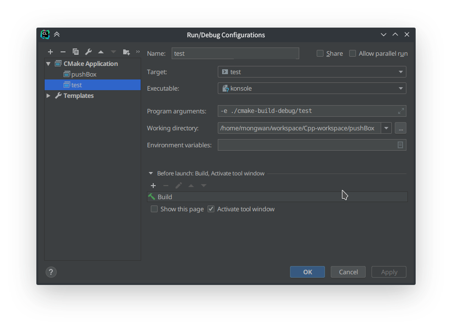
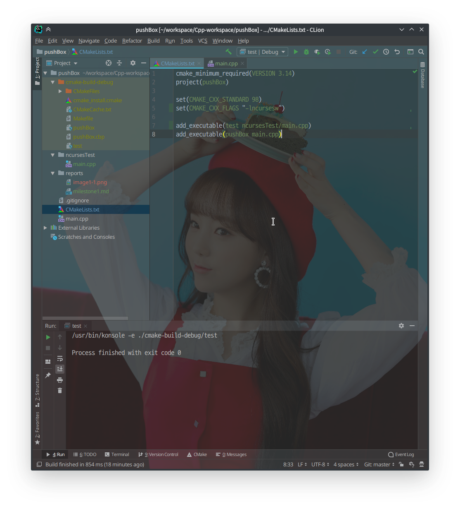
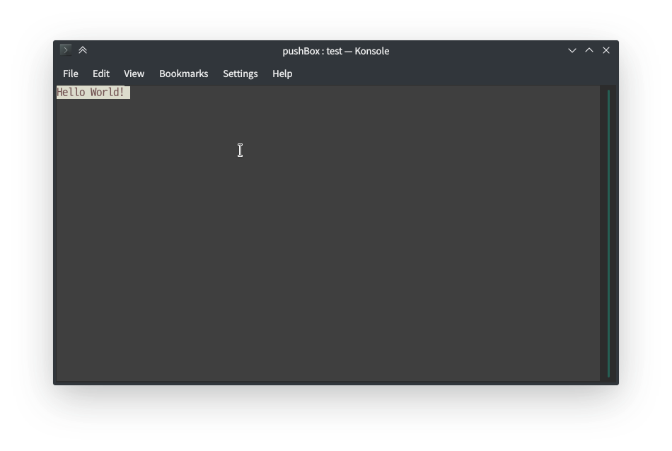

2019 C++ 프로그래밍 프로젝트
==========================
ncurses library를 사용한 Push Box Game 구현
--------------------------
20181649 유현석

## 작업 환경 설정
### CLion
전부터 사용하던 Jetbrain의 CLion을 이번 프로젝트에서도 활용하기 위해 몇가지 설정이 필요했다. CLion 내장 터미널에서는 ncurses가 구동되지 않았기 때문에, 외부 콘솔 창을 여는 것을 설정해야 했다.

현재 데스크탑 환경으로 KDE를 사용하기 때문에, 터미널은 내장되어있는 Konsole을 사용했다. 그림과 같이 설정함으로써 CLion에서 실행 버튼을 누르는 것 만으로 build를 한 뒤에 Konsole을 열어 현재 작성중인 코드를 실행할 수 있게 되었다.
[이 링크의 글](https://stackoverflow.com/questions/36675012/how-to-execute-a-clion-program-in-gnome-terminal)을 참고하였다.

### CMakeLists
CLion에서는 CMake를 이용해 프로그램을 빌드한다. 따라서 CMakeLists.txt를 수정하여 ncurses를 빌드 환경에 추가해주어야한다. 이는 단순히 빌드 옵션에 -lncurses를 추가하는 것으로 가능하다. [이 링크의 글](https://stackoverflow.com/questions/41017629/link-ncurses-in-clion-cmake)을 참고하였다.

## ncurses 기본 알아보기
### 창 띄우기
주어진 예제를 참고하여 터미널 창에 Hello, World!를 출력했다.

    #include <ncurses.h>
    int main() {
        initscr();
        start_color();
        init_pair(1, COLOR_RED, COLOR_WHITE);

        attron(COLOR_PAIR(1));
        printw("Hello World!");
        attroff(COLOR_PAIR(1));

        refresh();
        getch();
        endwin();

        return 0;
    }

