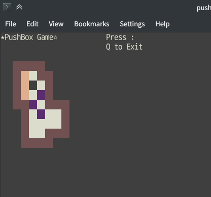
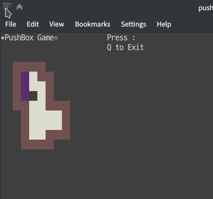

# 2단계
## 2단계 개발설계
사용자가 키보드 방향키를 입력하면, 캐릭터를 기준으로 그 방향의 타일에 무엇이 있는지 확인한다.
1. 벽이라면, 이동할 수 없으므로 무시한다.
2. 상자라면, 그 방향의 다음 타일을 확인한다.
    1. 그 다음 타일이 벽 또는 상자라면 이동할 수 없으므로 무시한다.
    2. 그 다음 타일이 빈 공간 또는 목표 지점이라면, 상자를 그 빈 공간에 옮기고 직전의 상자 위치로 캐릭터를 옮긴다.
3. 빈 공간 또는 목표 지점이라면, 캐릭터를 그 타일로 옮긴다.

        #include <ncurses.h>
        #include <clocale>
        #include <memory.h>
        
        enum Direction {LEFT, RIGHT, UP, DOWN};
        enum Tile {DEFAULT, WALL, BOX, GOAL, OUTSIDE, CURR};
        enum Pair {P_DEFAULT = 1, P_WALL, P_BOX, P_GOAL, P_OUTSIDE, P_CURR};
        // Enum starts with 1 because We can't assign 0 to COLOR_PAIR palette.
        
        struct Pos {
            int y;
            int x;
            Direction heading;
        };
        
        Pos chk_pos(Direction dir, Pos curr);
        void refr_game(WINDOW* w, Pos curr);
        
        int origin_arr1[9][7] = {
                {1, 1, 1, 1, 4, 4, 4},
                {1, 3, 0, 1, 1, 4, 4},
                {1, 3, 0, 0, 1, 4, 4},
                {1, 3, 0, 2, 1, 4, 4},
                {1, 1, 2, 0, 1, 1, 1},
                {4, 1, 0, 2, 0, 0, 1},
                {4, 1, 0, 0, 0, 0, 1},
                {4, 1, 0, 0, 1, 1, 1},
                {4, 1, 1, 1, 1, 4, 4}
    
        };
        
        int arr1_height = 9;
        int arr1_width = 7;
        int curr_arr[9][7];
        int main() {
            memcpy(curr_arr, origin_arr1, sizeof(origin_arr1));
    
            setlocale(LC_ALL, ""); // to use unicode
    
            Pos curr = {2, 2, LEFT}; // y, x, Dir
            WINDOW *game_win;
    
            initscr();
            keypad(stdscr, TRUE);
            curs_set(0);
            noecho();
            resize_term(40, 40);
    
            start_color();
            init_pair(P_DEFAULT, COLOR_WHITE, COLOR_WHITE);
            init_pair(P_WALL, COLOR_RED, COLOR_RED);
            init_pair(P_BOX, COLOR_MAGENTA, COLOR_MAGENTA);
            init_pair(P_GOAL, COLOR_YELLOW, COLOR_YELLOW);
            init_pair(P_OUTSIDE, COLOR_BLACK, COLOR_BLACK);
            init_pair(P_CURR, COLOR_WHITE, COLOR_GREEN);
    
            mvprintw(0, 0, "★PushBox Game☆"); // length = 14
            mvprintw(0, 26, "Press :"); // length = 7
            mvprintw(1, 26, "Q to Exit"); // length = 9
            refresh();
    
            game_win = newwin(arr1_height, arr1_width*2, 3, 3);
            wbkgd(game_win, COLOR_PAIR(DEFAULT));
    
            refr_game(game_win, curr);
    
            int chr = 0;
            Pos chk = curr;
            while (chr != 'q' && chr != 'Q') {
                chr = getch();
    
                if (chr == KEY_LEFT) chk = chk_pos(LEFT, curr);
                else if (chr == KEY_RIGHT) chk = chk_pos(RIGHT, curr);
                else if (chr == KEY_UP) chk = chk_pos(UP, curr);
                else if (chr == KEY_DOWN) chk = chk_pos(DOWN, curr);
    
                int chk_num = curr_arr[chk.y][chk.x];
    
                if (chk_num == WALL) continue; // heading to wall
                else if (chk_num == DEFAULT || chk_num == GOAL) {
                    curr.y = chk.y;
                    curr.x = chk.x;
                    refr_game(game_win, curr);
                }
                else if (chk_num == BOX) {
                    Pos alt_chk = chk_pos(chk.heading, chk);
                    int alt_chk_num = curr_arr[alt_chk.y][alt_chk.x];
    
                    if (alt_chk_num == WALL || alt_chk_num == BOX) continue;
                    else if (alt_chk_num == DEFAULT || alt_chk_num == GOAL) {
                        curr_arr[alt_chk.y][alt_chk.x] = BOX;
                        curr_arr[chk.y][chk.x] = DEFAULT;
                        curr.y = chk.y;
                        curr.x = chk.x;
                        refr_game(game_win, curr);
                    }
                }
            }
    
            delwin(game_win);
            endwin();
    
            return 0;
        }
        
        Pos chk_pos(Direction dir, Pos curr) {
            Pos chk = {0, 0, LEFT};
            switch (dir) {
                case LEFT:
                    chk.heading = LEFT;
                    chk.y = curr.y;
                    chk.x = curr.x-1;
                    break;
                case RIGHT:
                    chk.heading = RIGHT;
                    chk.y = curr.y;
                    chk.x = curr.x+1;
                    break;
                case UP:
                    chk.heading = UP;
                    chk.y = curr.y-1;
                    chk.x = curr.x;
                    break;
                case DOWN:
                    chk.heading = DOWN;
                    chk.y = curr.y+1;
                    chk.x = curr.x;
                    break;
            }
    
            return chk;
        }
        
        void refr_game(WINDOW *w, Pos curr) {
            for(int y=0; y < arr1_height; y++) {
                for(int x=0; x < arr1_width*2; x++) {
                    int n = curr_arr[y][x];
                    wattron(w, COLOR_PAIR(n+1));
                    char *c = new char;
                    sprintf(c, "%d", n);
                    mvwprintw(w, y, (x*2), c);
                    mvwprintw(w, y, (x*2)+1, c);
                    wattroff(w, COLOR_PAIR(n+1));
                    delete c;
                }
            }
    
            wattron(w, COLOR_PAIR(CURR));
            mvwprintw(w, curr.y, (curr.x*2), "C");
            mvwprintw(w, curr.y, (curr.x*2)+1, "C");
            wattron(w, COLOR_PAIR(CURR));
    
            wrefresh(w);
            refresh();
        }

### 개요
- Direction 열거형은 현재 바라보고 있는 방향을 더 이해하기 쉽도록 만들었다.
- Pair과 Tile을 같은 열거형으로 사용하려고 했으나, 색상 Pair은 index가 1부터 시작해야 했고(COLOR_PAIR가 0을 넣었을때 정상적으로 작동하지 않았다.) Tile은 0부터 시작해야 했기 때문에 구분했다.
- 구조체 Pos를 만들었다. Pos는 (int) y 좌표, (int) x 좌표, 현재 바라보고 있는 방향인 열거형 Direction을 포함한다. 현재 바라보는 방향은 박스를 밀 때 그 다음 칸이 이동 가능한지 확인할 때 쓰인다.

- chk_pos 함수는 이동할 방향과, 현재 위치 좌표를 받아 한칸 이동한 그 좌표를 반환한다. 반복 사용이 많은 코드기 때문에 함수로 구분했다.
- refr_game 함수는 게임 윈도우와 현재 위치를 받아 게임 윈도우를 refresh한다. 게임이 시작될때, 이동 할 때 호출된다.

- 현재 바뀐 상태를 저장하는 배열과 기존 배열을 구분했다. 추후에 다시 시작 기능 등을 구현하기 위해서 필요하다. 배열 복사를 위해 memcpy를 사용했고, 이는 memory.h 헤더에 저장되어있다. 구현의 용이함을 위해 전역변수로 선언했다.

- int chr은 입력받을 문자를 저장하는 변수이다.
- Pos chk는 chk_pos의 반환값을 저장한다. 그 체크중인 타일이 이동 가능한지 파악하는 코드는 main()에 있다.
- if~else if 구문은 위의 개발설계를 그대로 반영했다. 이 이동 과정은 (현재는) Q가 입력되기 전까지 가능하다.

초기 상태

게임을 클리어한 상태

### 현재 문제점
- 94번 line에서, GOAL 위에 상자가 올라갔다가, 다시 상자가 사라지면 GOAL로 남아있어야 하는데 DEFAULT로 초기화된다. 단순히 DEFAULT를 입력하게끔 코드를 작성했기 때문인데, 이는 3차 과제를 작성하면서 배열의 원형을 불러오는 방법으로 수정할 것이다.
- MAP을 하나만 사용할 수 있게끔 코드가 작성되어 있기 때문에 이를 수정하려면 배열을 참조하는 전체 구조를 조금씩 바꿀 필요가 있다. 이도 3차 과제에서 수정할 예정이다.
- 57번 line에서, 분명 배경을 COLOR_GREEN으로 설정했지만 적용되지 않았는데, 색상 적용이 확실히 되지 않는 것이 현재 나의 터미널 환경의 문제인지 코드의 문제인지 파악하고 고쳐야 한다.