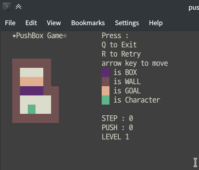

2019 C++ 프로그래밍 프로젝트
==========================
ncurses library를 사용한 Push Box Game 구현
--------------------------
20181649 유현석
## 구현 이미지

초기 상태

LEVEL 2를 클리어하기 직전의 상태

모든 스테이지를 클리어한 상태

## 최종 코드
### stages.h
    #ifndef PUSHBOX_STAGES_H
    #define PUSHBOX_STAGES_H

    const int STAGEN = 5;
    const int heights[STAGEN] = {7, 9, 6, 8, 8};
    const int widths[STAGEN] = {6, 7, 8, 7, 10};
    const int init_curr[STAGEN][2] = {
            {5, 2},
            {2, 2},
            {2, 6},
            {6, 3},
            {4, 6}
    };
    const int boxn[STAGEN] = {3, 3, 3, 6, 3};
    int stage1[7][6] = {
            {1, 1, 1, 1, 1, 4},
            {1, 0, 0, 0, 1, 4},
            {1, 3, 3, 3, 1, 4},
            {1, 2, 2, 2, 1, 1},
            {1, 0, 0, 0, 0, 1},
            {1, 0, 0, 0, 0, 1},
            {1, 1, 1, 1, 1, 1}
    };

    int stage2[9][7] = {
            {1, 1, 1, 1, 4, 4, 4},
            {1, 3, 0, 1, 1, 4, 4},
            {1, 3, 0, 0, 1, 4, 4},
            {1, 3, 0, 2, 1, 4, 4},
            {1, 1, 2, 0, 1, 1, 1},
            {4, 1, 0, 2, 0, 0, 1},
            {4, 1, 0, 0, 0, 0, 1},
            {4, 1, 0, 0, 1, 1, 1},
            {4, 1, 1, 1, 1, 4, 4}
    };

    int stage3[6][8] = {
            {1, 1, 1, 1, 1, 1, 1, 1},
            {1, 3, 0, 0 ,0, 0, 0, 1},
            {1, 0, 3, 2, 2, 2, 0, 1},
            {1, 3, 0, 0, 0, 0, 0, 1},
            {1, 1, 1, 1, 1, 0, 0, 1},
            {4, 4, 4, 4, 1, 1, 1, 1}
    };

    int stage4[8][7] = {
            {1, 1, 1, 1, 1, 1, 1},
            {1, 0, 0, 0, 0, 0, 1},
            {1, 0, 3, 2, 3, 0, 1},
            {1, 0, 2, 3, 2, 0, 1},
            {1, 0, 3, 2, 3, 0, 1},
            {1, 0, 2, 3, 2, 0, 1},
            {1, 0, 0, 0, 0, 0, 1},
            {1, 1, 1, 1, 1, 1, 1}
    };

    int stage5[8][10] = {
            {4, 1, 1, 1, 1, 4, 4, 4, 4, 4},
            {4, 1, 0, 0, 1, 1, 1, 1, 4, 4},
            {4, 1, 0, 0, 0, 0, 0, 1, 1, 4},
            {1, 1, 0, 1, 1, 0, 0, 0, 1, 4},
            {1, 3, 0, 3, 1, 0, 0, 2, 1, 1},
            {1, 0, 0, 0, 1, 0, 2, 2, 0, 1},
            {1, 0, 0, 3, 1, 0, 0, 0, 0, 1},
            {1, 1, 1, 1, 1, 1, 1, 1, 1, 1}
    };

    int* stagep[STAGEN] = {(int*)stage1, (int*)stage2, (int*)stage3, (int*)stage4, (int*)stage5};
    #endif //PUSHBOX_STAGES_H

### main.cpp
    #include <ncurses.h>
    #include <clocale>
    #include <vector>
    #include "stages.h"

    enum Direction {LEFT, RIGHT, UP, DOWN};
    enum Tile {DEFAULT, WALL, BOX, GOAL, CURR = 5};
    enum Pair {P_DEFAULT = 1, P_WALL, P_BOX, P_GOAL, P_OUTSIDE, P_CURR};
    // Enum starts with 1 because We can't assign 0 to COLOR_PAIR palette.
    struct Pos { int y; int x; Direction heading; };

    Pos chk_pos(Direction dir, Pos curr);
    void refr_game(WINDOW* w, Pos curr, std::vector< std::vector<int> > curr_status);
    void refr_info(WINDOW* w);

    int step = 0;
    int push = 0;
    int level = 0;
    bool cleared = false;

    int main() {
        setlocale(LC_ALL, ""); // to use unicode

        WINDOW *game_win;
        WINDOW *info_win;

        initscr();
        keypad(stdscr, TRUE);
        curs_set(0);
        noecho();
        resize_term(40, 45);

        start_color();
        init_pair(P_DEFAULT, COLOR_WHITE, COLOR_WHITE);
        init_pair(P_WALL, COLOR_RED, COLOR_RED);
        init_pair(P_BOX, COLOR_MAGENTA, COLOR_MAGENTA);
        init_pair(P_GOAL, COLOR_YELLOW, COLOR_YELLOW);
        init_pair(P_OUTSIDE, COLOR_BLACK, COLOR_BLACK);
        init_pair(P_CURR, COLOR_GREEN, COLOR_GREEN);

        mvprintw(0, 0, "   ★PushBox Game☆"); // length = 17
        mvprintw(0, 26, "Press :"); // length = 7
        mvprintw(1, 26, "Q to Exit"); // length = 9
        mvprintw(2, 26, "R to Retry");
        mvprintw(3, 26, "arrow key to move");

        attron(COLOR_PAIR(P_BOX));
        mvprintw(4, 26, "  ");
        attroff(COLOR_PAIR(P_BOX));
        mvprintw(4, 28, " is BOX");
        attron(COLOR_PAIR(P_WALL));
        mvprintw(5, 26, "  ");
        attroff(COLOR_PAIR(P_WALL));
        mvprintw(5, 28, " is WALL");
        attron(COLOR_PAIR(P_GOAL));
        mvprintw(6, 26, "  ");
        attroff(COLOR_PAIR(P_GOAL));
        mvprintw(6, 28, " is GOAL");
        attron(COLOR_PAIR(P_CURR));
        mvprintw(7, 26, "  ");
        attroff(COLOR_PAIR(P_CURR));
        mvprintw(7, 28, " is Character");

        refresh();

        std::vector< std::vector<int> > curr_status;
        for (int i = 0; i < heights[level]; i++) {
            curr_status.push_back(std::vector<int>());
            for (int j = 0; j < widths[level]; j++)
                curr_status[i].push_back(stagep[level][i * widths[level]+j]);
        }
        Pos curr = {init_curr[level][0], init_curr[level][1], LEFT}; // y, x, Dir

        game_win = newwin(heights[level], widths[level]*2, 3, 3);
        wbkgd(game_win, COLOR_PAIR(DEFAULT));
        refr_game(game_win, curr, curr_status);

        info_win = newwin(20, 15, 9, 26);
        wbkgd(game_win, COLOR_PAIR(DEFAULT));
        mvwprintw(info_win, 0, 0, "STEP : ");
        mvwprintw(info_win, 1, 0, "PUSH : ");
        mvwprintw(info_win, 2, 0, "LEVEL");
        refr_info(info_win);

        refresh();

        int chr = 0;
        Pos chk;
        int not_goaled_box = boxn[level];
        while (chr != 'q' && chr != 'Q') {
            chr = getch();

            if (chr == KEY_LEFT) chk = chk_pos(LEFT, curr);
            else if (chr == KEY_RIGHT) chk = chk_pos(RIGHT, curr);
            else if (chr == KEY_UP) chk = chk_pos(UP, curr);
            else if (chr == KEY_DOWN) chk = chk_pos(DOWN, curr);
            else if (chr == 'r' || chr == 'R') {
                step = 0;
                push = 0;
                not_goaled_box = boxn[level];

                curr_status.clear();
                for (int i = 0; i < heights[level]; i++) {
                    curr_status.push_back(std::vector<int>());
                    for (int j = 0; j < widths[level]; j++)
                        curr_status[i].push_back(stagep[level][i * widths[level]+j]);
                }

                curr.y = init_curr[level][0];
                curr.x = init_curr[level][1];
                curr.heading = LEFT; // y, x, Dir
                refr_game(game_win, curr, curr_status);
                refr_info(info_win);
                continue;
            }
            else continue;

            int chk_num = curr_status[chk.y][chk.x];

            if (chk_num == WALL) continue; // heading to wall
            else if (chk_num == DEFAULT || chk_num == GOAL) {
                curr.y = chk.y;
                curr.x = chk.x;
                refr_game(game_win, curr, curr_status);
                step += 1;
                refr_info(info_win);
            }
            else if (chk_num == BOX) {
                Pos alt_chk = chk_pos(chk.heading, chk);
                int alt_chk_num = curr_status[alt_chk.y][alt_chk.x];

                if (alt_chk_num == WALL || alt_chk_num == BOX) continue;
                else if (alt_chk_num == DEFAULT || alt_chk_num == GOAL) {
                    curr_status[alt_chk.y][alt_chk.x] = BOX;
                    curr_status[chk.y][chk.x] = (stagep[level][chk.y*widths[level]+chk.x] == GOAL) ?
                                                stagep[level][chk.y*widths[level]+chk.x]
                                                : DEFAULT;
                    curr.y = chk.y;
                    curr.x = chk.x;
                    refr_game(game_win, curr, curr_status);
                    step += 1;
                    push += 1;
                    refr_info(info_win);

                    if (stagep[level][chk.y*widths[level] + chk.x] == GOAL)
                        not_goaled_box += 1;
                    if (alt_chk_num == GOAL)
                        not_goaled_box -= 1;
                }
            }

            if (not_goaled_box <= 0) { // when stage clear
                curr_status.clear();

                wattron(game_win, COLOR_PAIR(P_OUTSIDE));
                for(int y=0; y < heights[level]+1; y++) {
                    for (int x = 0; x < widths[level]+1; x++)
                        mvprintw(y + 2, (x * 2) + 2, "    ");
                }
                wattroff(game_win, COLOR_PAIR(P_OUTSIDE));
                refresh();

                level += 1;
                if (level >= STAGEN) {
                    cleared = true;
                    break;
                }
                step = 0;
                push = 0;

                game_win = newwin(heights[level], widths[level]*2, 3, 3);

                for (int i = 0; i < heights[level]; i++) {
                    curr_status.push_back(std::vector<int>());
                    for (int j = 0; j < widths[level]; j++)
                        curr_status[i].push_back(stagep[level][i * widths[level]+j]);
                }

                not_goaled_box = boxn[level];
                curr.y = init_curr[level][0];
                curr.x = init_curr[level][1];
                curr.heading = LEFT; // y, x, Dir
                refr_game(game_win, curr, curr_status);
                refr_info(info_win);
            }
        }

        mvprintw(4, 4, cleared? "You win!" : "Quit game.");
        mvprintw(5, 4, "Press any key");
        mvprintw(6, 4, "to quit game");

        getch();
        delwin(game_win);
        endwin();

        return 0;
    }

    Pos chk_pos(Direction dir, Pos curr) {
        Pos chk = {0, 0, LEFT};
        switch (dir) {
            case LEFT:
                chk.heading = LEFT;
                chk.y = curr.y;
                chk.x = curr.x-1;
                break;
            case RIGHT:
                chk.heading = RIGHT;
                chk.y = curr.y;
                chk.x = curr.x+1;
                break;
            case UP:
                chk.heading = UP;
                chk.y = curr.y-1;
                chk.x = curr.x;
                break;
            case DOWN:
                chk.heading = DOWN;
                chk.y = curr.y+1;
                chk.x = curr.x;
                break;
        }

        return chk;
    }

    void refr_game(WINDOW *w, Pos curr, std::vector< std::vector<int> > curr_status) {
        for(int y=0; y < heights[level]; y++) {
            for(int x=0; x < widths[level]*2; x++) {
                int n = curr_status[y][x];
                wattron(w, COLOR_PAIR(n+1));
                char *c = new char;
                sprintf(c, "%d", n);
                mvwprintw(w, y, (x*2), c);
                mvwprintw(w, y, (x*2)+1, c);
                wattroff(w, COLOR_PAIR(n+1));
                delete c;
            }
        }

        wattron(w, COLOR_PAIR(P_CURR));
        mvwprintw(w, curr.y, (curr.x*2), "C");
        mvwprintw(w, curr.y, (curr.x*2)+1, "C");
        wattron(w, COLOR_PAIR(P_CURR));

        wrefresh(w);
        refresh();
    }

    void refr_info(WINDOW *w) {
        mvwprintw(w, 0, 7, "       ");
        mvwprintw(w, 1, 7, "       ");
        mvwprintw(w, 2, 6, "       ");
        char *c = new char;
        sprintf(c, "%d", step);
        mvwprintw(w, 0, 7, c);
        sprintf(c, "%d", push);
        mvwprintw(w, 1, 7, c);
        sprintf(c, "%d", level+1);
        mvwprintw(w, 2, 6, c);
        delete c;
        wrefresh(w);
    }

## 구현된 사항
- 구현되어야 하는 3단계의 내용은 모두 구현하였다.
- 게임 진행 중 Q를 누르면, 게임을 종료한다는 알림 이후에 창을 종료한다.
- 게임 진행 중 R을 누르면, 그 스테이지의 첫 상태로 게임을 초기화한다.
- 게임의 간단한 설명을 창 오른쪽에 표시했다.

## 개선 가능한 사항
- 친구의 테스트 결과 어려움 없이 잘 클리어 했으나, 처음에 각 타일이 무엇을 의미하는 것인지 잘 파악하지 못했다. 게임을 시작할 때 게임 방법을 창으로 표시하거나, 좀 더 눈에 잘 보이는 형식으로 바꾸면 좋을 것 같다.
- main 함수 내에 화면 표시와 관련해서 중복된 코드가 다수 있다. 이를 함수로 분리한다면 코드가 더 간결해 질 것이다.